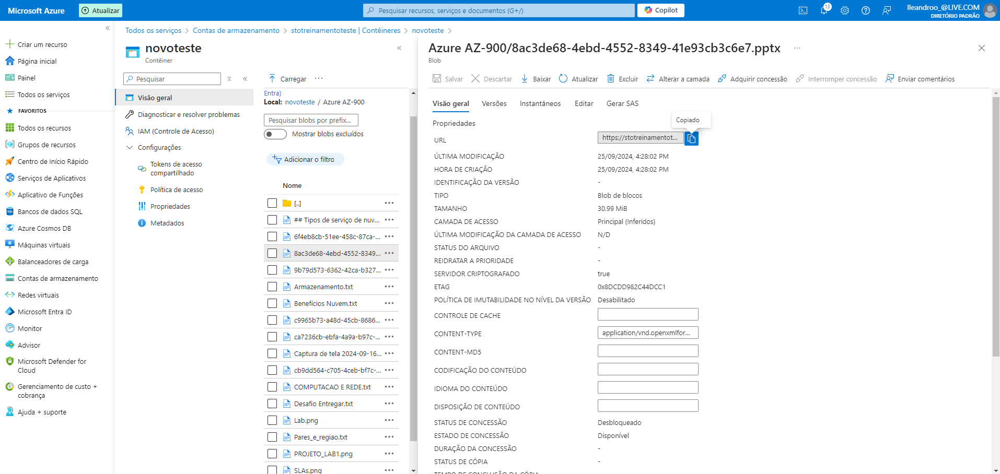

## resumo-do-lab5
Esse projeto você irá abordar e aprender estratégias de armazenamento e gerenciamento de dados dentro da Azure.

### Armazenamento

* Serviços de armazenamento
* Opções de redundância
* Gerenciamento e migração de arquivos

Armazenamento: domínio de objetivo

* Comparar os serviços de armazenamento do Azure.
* Descrever as camadas de armazenamento.
* Descrever as opções de redundância.
* Descrever as opções de conta de armazenamento e os tipos de armazenamento.
* Identificar opções para mover arquivos, incluindo o AzCopy, o Gerenciador de Armazenamento do Azure e a Sincronização de Arquivos do Azure.
* Descrever as opções de migração, incluindo as Migrações para Azure e o Azure Data Box.

### Contas de Armazenamento

* Deve ter um globalmente nome exclusivo.
* Fornecer acesso à Internet em todo o mundo.
* Determinar os serviços de armazenamento e as opções de redundância.

### Serviços de armazenamento do Azure

* Blob do Azure: otimizado para o armazenamento de quantidades massivas de dados não estruturados, como texto ou dados binários.

* Disco do Azure: fornece discos para máquinas virtuais, aplicativos e outros serviços acessarem e utilizarem.

* Fila do Azure: serviço de armazenamento de mensagens que fornece armazenamento e recuperação para grandes quantidades de mensagens, cada uma com até 64 KB.

* Arquivos do Azure: configura um compartilhamento de arquivos de rede altamente disponível que pode ser utilizado usando o protocolo Bloco de Mensagens do Servidor.

* Tabelas do Azure: fornece uma opção de chave/atributo para o armazenamento de dados estruturados não relacionais com um design sem esquema.

### Migrações para o Azure

* Plataforma de migração unificada.
* Intervalo de ferramentas integradas e autônomas.
* Avaliação e migração.

### Azure Data Box

* Armazenar até 80 terabytes de dados.
* Mova os backups de recuperação de desastre para o Azure.
* Proteja seus dados em uma caixa robusta durante o trânsito.
* Migre dados do Azure para conformidade ou necessidades regulatórias.
* Migre dados para o Azure de locais remotos com conectividade limitada ou sem conectividade.

### Opções de gerenciamento de arquivos

### AzCopy

* Utilitário de linha de comando.
* Copiar blobs ou arquivos de ou para sua conta de armazenamento.
* Sincronização em uma direção.

### Gerenciador de Armazenamento do Azure

* Interface gráfica do usuário (de modo semelhante ao Windows Explorer).
* Compatível com o Windows, MacOS e Linux.

### Sincronização de Arquivos do Azure

* Sincroniza os arquivos do Azure e locais de forma bidirecional.
* A camada de nuvem mantém os arquivos acessados com frequência no local, enquanto libera espaço.

